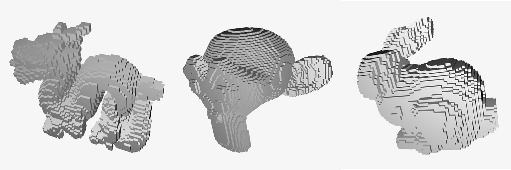

# Mesh voxelizer
_Header only mesh voxelizer in ANSI C_



**About**

Converts meshes and performs triangle-cube intersection to output a voxelized mesh.

**How to use**

Include the header only file as following once:
```c
#define VOXELIZER_IMPLEMENTATION
#include "voxelizer.h"
```

To generate a voxelized mesh, create an instance of `vx_mesh_t` and initialize its
vertices and indices like this:

```c
vx_mesh_t* mesh;
vx_mesh_t* result;

mesh = vx_mesh_alloc(nvertices, nindices);

// Add vertices and indices from the original mesh you want to voxelize
// [...]

// Precision factor to reduce "holes" artifact
float precision = 0.01;

// Run voxelization
result = vx_voxelize(mesh, 0.025, 0.025, 0.025, precision);

vx_mesh_free(result);
vx_mesh_free(mesh);
```
